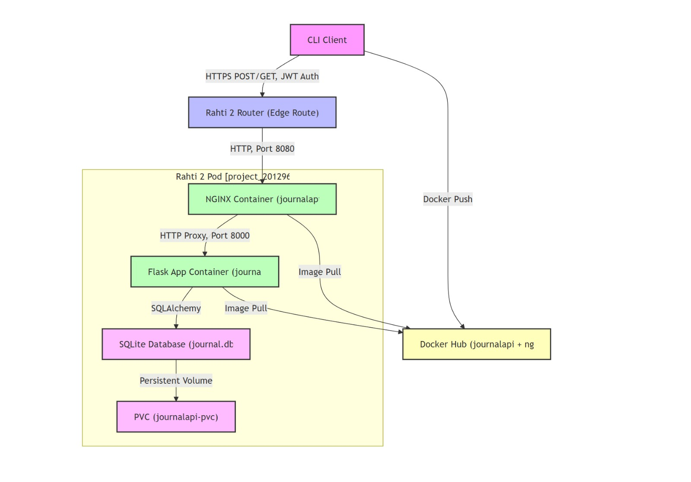

# PWP SPRING 2025
# Journal API
# Group information
* Student 1. Muhammad Ramish (mramish24@student.oulu.fi)
* Student 2. Name and email
* Student 3. Name and email
* Student 4. Name and email




# Journal API

The Journal API is a RESTful web service designed to help users manage daily journaling activities. It allows users to create, view, edit, and delete journal entries, perform sentiment analysis on entries, and interact with comments on public or shared entries. The API is built using Flask, a lightweight Python web framework, and uses SQLite for database management.

---

## Features

- **User Management**: Register, log in, and manage user profiles.
- **Journal Entry Management**: Create, retrieve, update, and delete journal entries.
- **Sentiment Analysis**: Automatically analyze the emotional sentiment of journal entries.
- **Comment Management**: Add, retrieve, update, and delete comments on journal entries.
- **Authentication**: Secure access to resources using JWT (JSON Web Tokens).

---

## Table of Contents

1. [Installation](#installation)
2. [Database Setup](#database-setup)
3. [Running the API](#running-the-api)
4. [Testing](#testing)
5. [API Endpoints](#api-endpoints)
6. [Dependencies](#dependencies)
7. [Contributing](#contributing)
8. [License](#license)

---

## Installation

To set up the Journal API, follow these steps:

1. **Clone the repository**:
   ```bash
   git clone https://github.com/darisdzakwanhoesien2/PWP_JournalAPI.git
   cd journal-api
   ```

2. **Create a virtual environment** (optional but recommended):
   ```bash
   python -m venv venv
   source venv/bin/activate  # On Windows, use `venv\Scripts\activate`
   ```

3. **Install dependencies**:
   ```bash
   pip install -r requirements.txt
   ```

---

## Database Setup

The API uses SQLite for database management. To initialize the database, run the following command:

```bash
python init_db.py
```

This will create the necessary tables in the database. To populate the database with sample data, run:

```bash
python insert_from_files.py
```


---

## Running the API

To start the API server, run:

```bash
python app.py
```

The API will be available at `http://localhost:5000`.

---

## Testing

The project includes a suite of functional tests to ensure the API works as expected. To run the tests, use the following commands:

```bash
python -m pytest tests/test_user_routes.py
python -m pytest tests/test_journal_entry_routes.py
python -m pytest tests/test_comments.py
```

These tests cover user management, journal entry management, and comment functionality.

New Ways to Test it over
```bash
pytest tests/
```
---

## API Endpoints

The following table lists the available API endpoints:

| Resource Name       | Resource URL                          | Resource Description                                                                 | Supported Methods | Implemented |
|:-------------------:|:-------------------------------------:|:------------------------------------------------------------------------------------:|:-----------------:|:-----------:|
| User Management     | `/users/register`                     | Registers a new user with a username, email, and password.                           | POST              | Yes         |
|                     | `/users/login`                        | Authenticates a user and returns a JWT token for subsequent requests.                | POST              | Yes         |
|                     | `/users/{user_id}`                    | Retrieves, updates, or deletes a user's details based on the provided `user_id`.     | GET, PUT, DELETE  | Yes         |
| Journal Entry       | `/entries/`                           | Creates a new journal entry or retrieves all entries for the authenticated user.     | POST, GET         | Yes         |
|                     | `/entries/{entry_id}`                 | Retrieves, updates, or deletes a specific journal entry based on the `entry_id`.     | GET, PUT, DELETE  | Yes         |
| Comment Management  | `/entries/{entry_id}/comments`        | Adds a new comment to a journal entry or retrieves all comments for the entry.       | POST, GET         | Yes         |
|                     | `/comments/{comment_id}`              | Updates or deletes a specific comment based on the `comment_id`.                    | PUT, DELETE       | Yes         |

---

## Dependencies

The Journal API relies on the following Python libraries:

- **Flask**: Web framework for building the API.
- **Flask-SQLAlchemy**: ORM for database management.
- **Flask-JWT-Extended**: JWT-based authentication.
- **Pytest**: Testing framework for functional tests.

All dependencies are listed in `requirements.txt`.

---

## Contributing

Contributions to the Journal API are welcome! If you'd like to contribute, please follow these steps:

1. Fork the repository.
2. Create a new branch for your feature or bugfix.
3. Make your changes and ensure all tests pass.
4. Submit a pull request with a detailed description of your changes.

---

## License

This project is licensed under the MIT License. See the [LICENSE](LICENSE) file for details.

---

## Contact

For questions or feedback, please contact Daris at [your.email@example.com].


A RESTful Flask API for journaling. Includes user management, entries, comments, JWT auth.

## Setup
```bash
pip install -e .
export FLASK_APP=rnalapi
flask run
```

## CLI
```bash
flask init-db
```

## Testing
```bash
pytest --cov=pwp_journalapi tests/
python -m pytest --cov=journalapi --cov-report=term-missing tests/

Perfect — let’s finish this strong!  
We’ll now tackle:

---

## ✅ Step 3: Help You Write the `README.md` / Wiki API Documentation Section

This is what you can copy-paste into your project `README.md` **or** course submission **wiki** page:

---

### 📘 API Documentation

#### 🔗 Live Documentation
- **Swagger UI**: [http://localhost:5000/apidocs](http://localhost:5000/apidocs)
- **Raw OpenAPI YAML**: [`docs/openapi.yaml`](./docs/openapi.yaml)
- Viewable via: [Swagger Editor](https://editor.swagger.io/)

---

### 📌 Overview

This project provides a secure journaling REST API that allows users to:

- Register and log in
- Create, update, and delete journal entries
- Comment on entries
- View edit history
- Use hypermedia links to navigate between resources

---

### 🔐 Authentication
All protected routes use **JWT Bearer Tokens**:
- Header format:  
  `Authorization: Bearer <your-token>`

---

### 🧱 Media Type
- All responses use `application/json`
- Hypermedia links are embedded as `_links` in each resource

---

### 📂 Resources and Link Relations

| Resource      | Link Relations                                                                 |
|---------------|----------------------------------------------------------------------------------|
| `User`        | `self`, `edit`, `delete`                                                        |
| `JournalEntry`| `self`, `edit`, `delete`, `comments`, `history`                                |
| `Comment`     | `self`, `edit`, `delete`                                                        |
| `EditHistory` | `self` (optional, if needed)                                                    |

Standard IANA links (`self`, `edit`, `delete`) are used where possible.  
Custom link relation: `comments`, `history` (justified below).

---

### 📡 Example Hypermedia Response

```json
{
  "id": 3,
  "title": "My Journal",
  "tags": ["reflection", "grateful"],
  "_links": {
    "self": { "href": "/entries/3" },
    "edit": { "href": "/entries/3" },
    "delete": { "href": "/entries/3" },
    "comments": { "href": "/entries/3/comments" },
    "history": { "href": "/entries/3/history" }
  }
}
```

---

### 🚧 Error Handling

| Code | Meaning              | Example                        |
|------|----------------------|--------------------------------|
| 422  | Validation Error     | Missing required field         |
| 401  | Unauthorized         | Token missing or invalid       |
| 403  | Forbidden            | User not allowed to access     |
| 404  | Not Found            | Resource doesn't exist         |

---

### 🧪 Functional Testing

- Run tests with:  
  `python -m pytest --cov=journalapi --cov-report=term-missing tests/`

- Test coverage: **96%+**
- Tests include:
  - Valid and invalid input
  - Auth protection
  - Link presence in hypermedia responses

---

## ✅ Step 4: Hypermedia State Diagram

I'll now describe what you should include in your diagram 👇

---

### 🔁 State Diagram Overview

Use a diagram tool (like draw.io or Lucidchart) to show the transitions between these states:

**States (circles/boxes):**
- Register
- Login
- `/users/{id}`
- `/entries/`
- `/entries/{id}`
- `/entries/{id}/comments`
- `/entries/{id}/history`

**Transitions (arrows):**
- `POST /users/register` → `POST /users/login`
- `POST /users/login` → `/users/{id}` (GET, PUT, DELETE)
- `/users/{id}` → `/entries/` (GET, POST)
- `/entries/` → `/entries/{id}` → `/entries/{id}/comments` + `/entries/{id}/history`

**Example:**
```
[Register] → [Login] → [User Profile] → [Entries List] → [Entry Detail] → [Comments / History]
```

**Each arrow labeled with HTTP method.**

---

### ✅ Custom Link Relation Justification

- `comments`: used to navigate from a journal entry to its related comments. No standard IANA relation for this.
- `history`: used to navigate to a journal entry's edit history. Custom but semantically clear.

---

# PWP SPRING 2025
# Journal API

## Group Information
* Student 1. Muhammad Ramish (mramish24@student.oulu.fi)
* Student 2. Name and email
* Student 3. Name and email
* Student 4. Name and email

---

## Overview
The Journal API is a RESTful web service designed to help users manage daily journaling activities. It allows users to create, view, edit, and delete journal entries, perform sentiment analysis on entries, and interact with comments on public or shared entries. The API is built using Flask and secured using JWTs.

---

## 🚀 Features
- ✅ **User Registration & Login** with hashed passwords
- ✅ **JWT Authentication**
- ✅ **CRUD Journal Entries** with tagging and history
- ✅ **Comments API** per entry
- ✅ **Modular Flask RESTful API**
- ✅ **Typer-based Python CLI** for users
- ✅ **Swagger UI** available at `/apidocs/`
- ✅ **Production-ready Docker deployment**
- ✅ **Optional Auxiliary Service** for analytics

---

## 📁 Project Structure
```bash
PWP_JournalAPI/
├── app.py                    # Flask app factory with Swagger & JWT setup
├── client/                  # Typer-based CLI
│   ├── main.py              # CLI entry point
│   ├── auth_cli.py          # Register/Login/Logout
│   ├── entries_cli.py       # Create/View/Delete entries
│   ├── comments_cli.py      # Add/View/Delete comments
│   ├── config.py            # Token file path and API base URL
│   └── auth.py              # Token helpers
├── journalapi/              # API modules
│   ├── resources/           # RESTful resources
│   ├── models/              # SQLAlchemy models
│   ├── utils/               # JsonResponse, hypermedia utils
│   └── api.py               # Blueprint with all routes
├── docs/
│   └── openapi.yaml         # Full Swagger spec
├── Dockerfile
├── docker-compose.yml
├── init_db.py               # Initialize database
└── README.md
```

---

## 🧪 Quick Start (Local)
```bash
# Install deps
pip install -r requirements.txt

# Init DB (local SQLite)
python init_db.py

# Start API (dev)
flask --app app run --port=8000

# Access Swagger UI:
http://localhost:8000/apidocs/
```

---

## 🐳 Docker Deployment
```bash
# Build and start containers
docker-compose up --build

# Init DB in container
docker-compose exec journal-api python init_db.py
```

---

## 💻 CLI Client (Typer)
```bash
cd client/

# Register
python main.py auth register --username alice --email alice@example.com --password secure123

# Login
python main.py auth login --email alice@example.com --password secure123

# View entries
python main.py entry list

# Add entry
python main.py entry create --title "Test" --content "My first entry" --tags life,personal
```

---

## 📘 API Documentation
### 🔗 Live Documentation
- **Swagger UI**: [http://localhost:8000/apidocs](http://localhost:8000/apidocs)
- **Raw OpenAPI YAML**: [`docs/openapi.yaml`](./docs/openapi.yaml)

### 🔐 Authentication
JWT Bearer Token in `Authorization` header:
```
Authorization: Bearer <token>
```

### 📂 Hypermedia `_links`
Embedded links allow clients to navigate between resources:
```json
{
  "id": 3,
  "title": "My Journal",
  "tags": ["reflection", "grateful"],
  "_links": {
    "self": { "href": "/entries/3" },
    "edit": { "href": "/entries/3" },
    "delete": { "href": "/entries/3" },
    "comments": { "href": "/entries/3/comments" },
    "history": { "href": "/entries/3/history" }
  }
}
```

### 📡 Link Relations
| Resource      | Link Relations                         |
|---------------|------------------------------------------|
| `User`        | `self`, `edit`, `delete`                |
| `JournalEntry`| `self`, `edit`, `delete`, `comments`, `history` |
| `Comment`     | `self`, `edit`, `delete`                |

### 🚧 Error Handling
| Code | Meaning          | Example                      |
|------|------------------|------------------------------|
| 422  | Validation Error | Missing required field       |
| 401  | Unauthorized     | Token missing or invalid     |
| 403  | Forbidden        | User not allowed             |
| 404  | Not Found        | Resource doesn't exist       |

---

## 📜 API Endpoints
| Resource Name       | Resource URL                          | Resource Description                                                             | Methods         | Done |
|---------------------|----------------------------------------|----------------------------------------------------------------------------------|------------------|------|
| User Management     | `/users/register`                      | Register a new user                                                              | POST             | ✅   |
|                     | `/users/login`                         | Authenticate a user, return JWT                                                  | POST             | ✅   |
|                     | `/users/{id}`                          | Get, update, or delete user                                                      | GET, PUT, DELETE | ✅   |
| Journal Entry       | `/entries/`                            | Create or list user journal entries                                              | POST, GET        | ✅   |
|                     | `/entries/{entry_id}`                  | Retrieve, update, or delete a specific journal entry                             | GET, PUT, DELETE | ✅   |
| Comments            | `/entries/{entry_id}/comments`         | Add or list comments for an entry                                                | POST, GET        | ✅   |
|                     | `/comments/{comment_id}`               | Update or delete a comment                                                       | PUT, DELETE      | ✅   |
| Edit History        | `/entries/{entry_id}/history`          | View edit history of a journal entry                                             | GET              | ✅   |

---

## 📦 Dependencies
- **Flask**, **SQLAlchemy**: Core web & ORM
- **Flask-JWT-Extended**: Token auth
- **Typer**, **Requests**: CLI client
- **Pytest**: Functional testing

---

## 🔧 Auxiliary Service (Optional)
> Example: Run analytics/stats in background
```bash
python auxiliary_service.py
```

---

## 🧪 Testing
```bash
pytest --cov=journalapi tests/
```

---

## 📝 License
MIT License © 2025 Oulu PWP Team

---

## ✉️ Contact
For feedback, contact Daris at daris@example.com

---

## ✅ Submission Checklist
- [x] REST API working
- [x] JWT Secured
- [x] Swagger & CLI
- [x] Docker Ready
- [x] Wiki + Mermaid Diagrams
- [x] Auxiliary Service Ready

